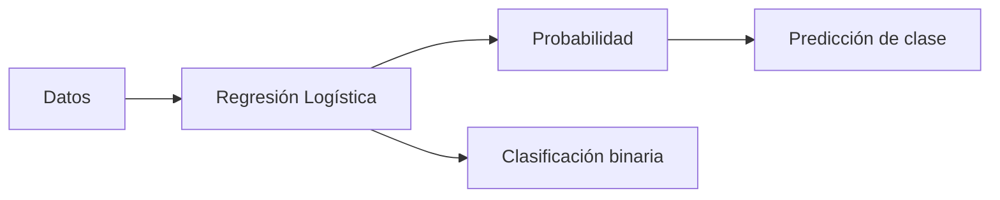

# Regresión Logística – Apuntes Técnicos con Diagramas

## Tabla de Contenidos
1. [Definición](#1-definición)
2. [Cuándo usar regresión logística](#2-cuándo-usar-regresión-logística)
3. [Aplicaciones y Uso Real](#3-aplicaciones-y-uso-real)
4. [Implementación en Python](#4-implementación-en-python)
5. [Evaluación del modelo](#5-evaluación-del-modelo)
6. [Ejemplo completo de código](#6-ejemplo-completo-de-código)

---

Este documento sirve como una guía técnica y práctica sobre la Regresión Logística, un algoritmo fundamental en el aprendizaje automático para problemas de clasificación. Aquí encontrarás desde su definición teórica y matemática hasta ejemplos de implementación en Python y métricas de evaluación.

## 1. Definición

La regresión logística es un algoritmo de clasificación supervisada que predice categorías a partir de variables de entrada (features). Produce probabilidades mediante la función sigmoide:

$$
\sigma(z) = \frac{1}{1 + e^{-z}}
$$

* **Objetivo:** No predice un valor numérico (como el precio de una casa), sino la **probabilidad** de que una observación pertenezca a una clase específica.
* **Salida:** Generalmente binaria (0 o 1, Sí o No, Positivo o Negativo).
* **Funcionamiento:** Utiliza la **Función Sigmoide** para transformar la salida de una ecuación lineal en un valor de probabilidad entre 0 y 1.

> [!IMPORTANT]
> **Regla de Decisión**
> * Si la probabilidad es $\ge 0.5$ $\rightarrow$ Clasifica como **1**.
> * Si la probabilidad es $< 0.5$ $\rightarrow$ Clasifica como **0**.
---

## 2. Cuándo usar regresión logística

### Situaciones adecuadas

- Clasificación binaria
- Problemas interpretables
- Datos linealmente separables
- Datasets pequeños o medianos
- Necesidad de probabilidades

### Situaciones no recomendables

- Relaciones muy no lineales
- Alta dimensionalidad sin regularización
- Fronteras de decisión complejas

### ¿Cuándo elegir Regresión Logística frente a otros?
Aunque existen modelos más complejos (Random Forest, XGBoost), la Regresión Logística es ideal en estos escenarios:
* **Necesidad de Explicabilidad:** Es "Caja Blanca". Puedes ver los coeficientes y saber exactamente qué variable influye positiva o negativamente en el resultado.
* **Modelo Base (Baseline):** Siempre debería ser el primer modelo que ejecutas para tener una referencia de rendimiento.
* **Pocos Datos:** Funciona bien en datasets pequeños donde modelos complejos harían overfitting.
* **Baja Latencia:** Es matemáticamente muy simple, por lo que las predicciones son extremadamente rápidas en producción.

---

## 3. Aplicaciones y Uso Real
Se utiliza fundamentalmente cuando la variable dependiente (target) es **categórica**.

* **Medicina:** Predecir si un paciente tiene una enfermedad (1) o no (0) basándose en síntomas.
* **Banca/Finanzas:** Scoring de crédito. ¿El cliente pagará el préstamo?
* **Marketing:** Predicción de abandono (Churn). ¿El cliente cancelará la suscripción este mes?
* **Ciberseguridad:** Detectar si un correo es Spam o una transacción es fraudulenta.

### Esquema conceptual

---

## 4. Implementación en Python
La librería estándar para este algoritmo es **Scikit-Learn**.

### Entrenamiento básico
```python
import pandas as pd
from sklearn.model_selection import train_test_split
from sklearn.linear_model import LogisticRegression
from sklearn.metrics import classification_report

X = df.drop("clase", axis=1)
y = df["clase"]

X_train, X_test, y_train, y_test = train_test_split(
    X, y, test_size=0.3, random_state=0
)

modelo = LogisticRegression(max_iter=1000)
modelo.fit(X_train, y_train)

predicciones = modelo.predict(X_test)
print(classification_report(y_test, predicciones))
```
---
## 5. Evaluación del modelo

### Matriz de confusión
| Real \ Predicción | 0   | 1   |
|-------------------|-----|-----|
| 0                 | TN  | FP  |
| 1                 | FN  | TP  |


Es una tabla que muestra:

- **TP (True Positive)**: Acierto positivo.
- **TN (True Negative)**: Acierto negativo.
- **FP (False Positive)**: Error tipo I (Falsa alarma).
- **FN (False Negative)**: Error tipo II (Omisión).

### Métricas de evaluación
| Métrica         | Definición                                                               | ¿Cuándo usarla?                                                                                 |
|-----------------|---------------------------------------------------------------------------|--------------------------------------------------------------------------------------------------|
| Accuracy        | % total de aciertos.                                                      | Solo si las clases (0 y 1) están equilibradas (aprox. 50/50).                                   |
| Precision       | De los que predije como Positivos, ¿cuántos lo eran realmente?            | Cuando el coste de una falsa alarma es alto (ej.: marcar como spam un correo importante).       |
| Recall          | De todos los Positivos reales, ¿cuántos detecté?                          | Cuando el coste de no detectar es alto (ej.: cáncer, fraude, fallas críticas).                  |
| F1-Score        | Media armónica entre Precision y Recall.                                   | Mejor métrica general para comparar modelos cuando las clases están desbalanceadas.            |

## 6. Ejemplo completo de código

```python
from sklearn.model_selection import train_test_split
from sklearn.linear_model import LogisticRegression
from sklearn.metrics import classification_report
import pandas as pd

df = pd.read_csv("datos.csv")

X = df.drop("clase_objetivo", axis=1)
y = df["clase_objetivo"]

X_train, X_test, y_train, y_test = train_test_split(
    X, y, test_size=0.3, random_state=1
)

modelo = LogisticRegression(max_iter=1000)
modelo.fit(X_train, y_train)

predicciones = modelo.predict(X_test)
print(classification_report(y_test, predicciones))
```

---