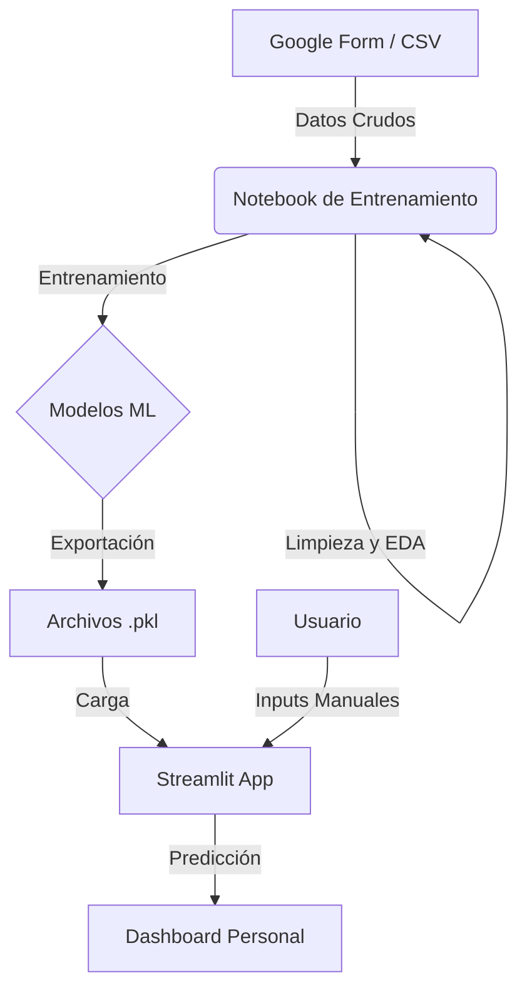

# Predicción de Productividad con Machine Learning

Este proyecto utiliza técnicas de Machine Learning para analizar y predecir la productividad personal basándose en hábitos diarios y factores ambientales. El sistema emplea modelos de regresión y clasificación para estimar tanto una puntuación numérica de productividad como una categoría cualitativa.

## Tabla de Contenido

- [Descripción del Proyecto](#descripción-del-proyecto)
- [Estructura del Repositorio](#estructura-del-repositorio)
- [Requisitos](#requisitos)
- [Instalación](#instalación)
- [Uso](#uso)
- [Características del Dataset](#características-del-dataset)
- [Modelos Implementados](#modelos-implementados)
- [Arquitectura](#arquitectura)
- [Contribución](#contribución)
- [Licencia](#licencia)

## Descripción del Proyecto

El objetivo principal es proporcionar una herramienta personalizada que permita:
- **Predecir el rendimiento** diario en función de variables como el sueño, el tiempo de estudio y el estado de ánimo.
- **Optimizar rutinas** identificando los factores que más influyen en la productividad.
- **Visualizar patrones** de comportamiento a través de un dashboard interactivo.

El sistema predice:
1.  **Productividad Numérica (1–5)**: Estimación precisa mediante un modelo de regresión.
2.  **Categoría de Productividad**: Clasificación en niveles (Bajo, Medio, Alto).

## Estructura del Repositorio

```text
├── productividad_estudio.csv   # Dataset con registros diarios
├── notebook.ipynb              # Notebook para limpieza, EDA y entrenamiento
├── modelo_regresion.pkl        # Modelo entrenado para predicción numérica
├── modelo_clasificacion.pkl    # Modelo entrenado para clasificación categórica
├── streamlit_app.py            # Aplicación web para visualización y predicción
└── README.md                   # Documentación del proyecto
```

## Requisitos

Para ejecutar este proyecto, necesitas tener instalado Python y las siguientes bibliotecas:

-   Python 3.8+
-   pandas
-   scikit-learn
-   streamlit
-   Jupyter/Colab (para ejecutar el notebook)

## Instalación

1.  Clona este repositorio:
    ```bash
    git clone <url-del-repositorio>
    ```
2.  Navega al directorio del proyecto:
    ```bash
    cd "Predict Your Study Productivity"
    ```
3.  Instala las dependencias necesarias (se recomienda usar un entorno virtual):
    ```bash
    pip install pandas scikit-learn streamlit jupyter
    ```

## Uso

### Entrenamiento de Modelos
Si deseas reentrenar los modelos con nuevos datos:
1.  Actualiza el archivo `productividad_estudio.csv` con tus nuevos registros.
2.  Abre y ejecuta el archivo `notebook.ipynb` en Jupyter Notebook o Google Colab.
3.  Los nuevos modelos `.pkl` se guardarán automáticamente en el directorio.

### Ejecución de la Aplicación Web
Para iniciar el dashboard interactivo y realizar predicciones en tiempo real:
```bash
streamlit run streamlit_app.py
```

## Características del Dataset

El modelo se entrena utilizando las siguientes variables de entrada:

| Variable | Descripción | Rango/Tipo |
| :--- | :--- | :--- |
| **Horas de sueño** | Tiempo de descanso nocturno | Numérico |
| **Tiempo de estudio** | Duración de la sesión de estudio | Minutos |
| **Distracción** | Nivel percibido de distracción | 0 - 10 |
| **Energía** | Nivel de energía física/mental | 1 - 5 |
| **Dificultad** | Complejidad de la materia estudiada | 1 - 5 |
| **Uso del móvil** | Tiempo de uso del dispositivo | Minutos |
| **Ruido ambiente** | Nivel de ruido en el entorno | 0 - 10 |
| **Descanso previo** | Si hubo descanso antes de estudiar | Sí / No |
| **Estado de ánimo** | Valoración emocional | 1 - 5 |

**Variable Objetivo:** Productividad final (valor numérico y categórico).

## Modelos Implementados

Se han seleccionado algoritmos de **Random Forest** debido a su robustez con datasets pequeños, resistencia al overfitting y capacidad de interpretación.

-   **RandomForestRegressor**: Para la predicción numérica.
-   **RandomForestClassifier**: Para la clasificación por categorías.

## Arquitectura

El flujo de datos del proyecto se estructura de la siguiente manera:



## Contribución

Las contribuciones son bienvenidas. Si deseas mejorar los modelos o la interfaz:
1.  Haz un Fork del repositorio.
2.  Crea una rama para tu feature (`git checkout -b feature/NuevaFuncionalidad`).
3.  Haz Commit de tus cambios (`git commit -m 'Añadir nueva funcionalidad'`).
4.  Haz Push a la rama (`git push origin feature/NuevaFuncionalidad`).
5.  Abre un Pull Request.

## Licencia

Este proyecto se distribuye bajo la licencia MIT. Consulta el archivo `LICENSE` para más detalles.
